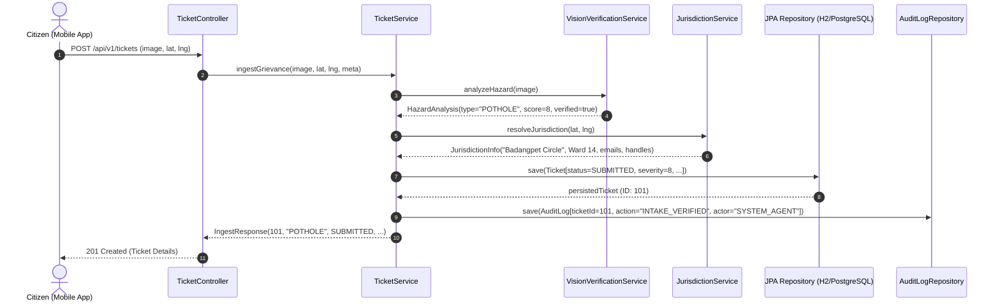
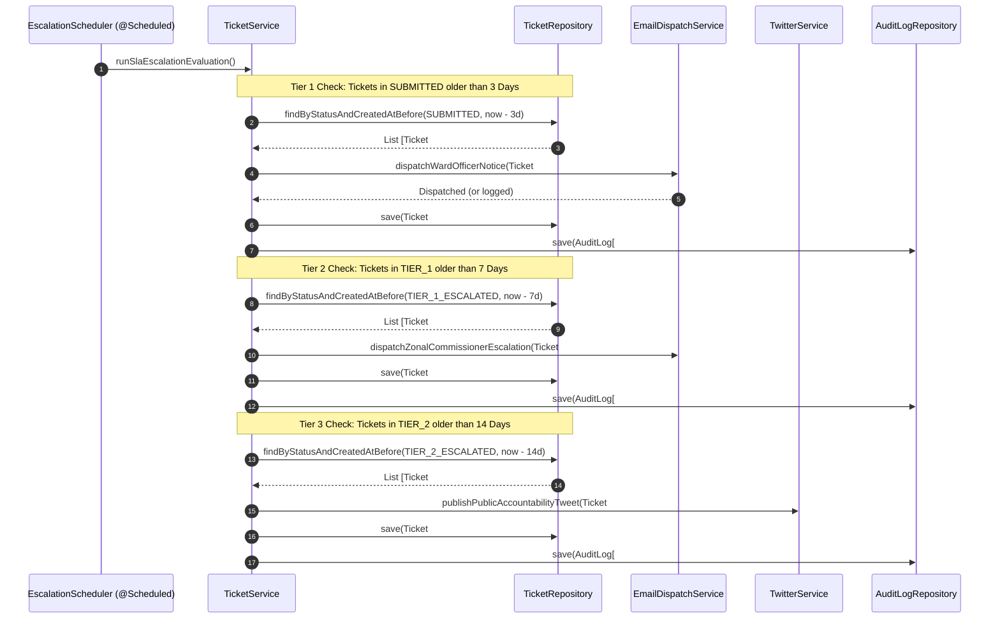
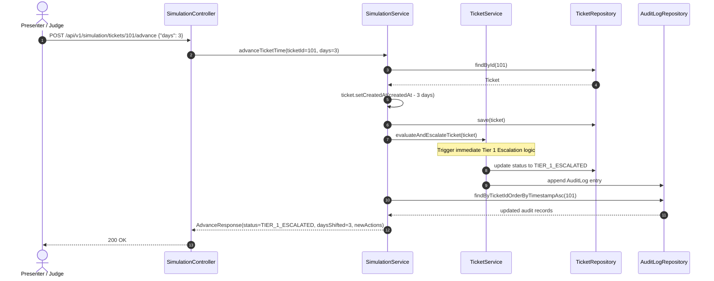
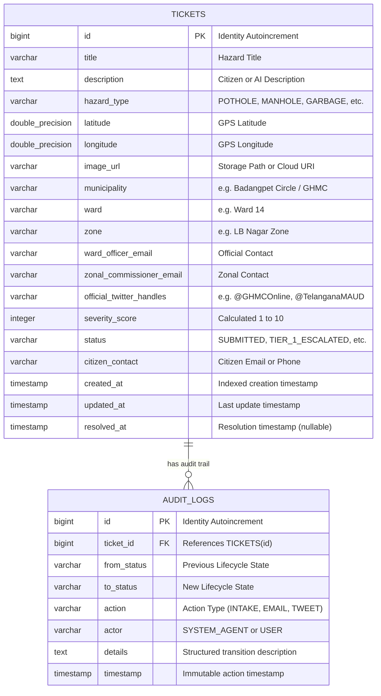

# System Architecture Specification

## Project: CivicAdvocate — Autonomous Civic Grievance & Escalation Agent
**Document:** System Architecture  
**Version:** 1.0.0  
**Stack:** Spring Boot 3.3.x, Java 17 LTS, Spring Data JPA, PostgreSQL / H2, Expo React Native  

---

## 1. High-Level Architecture Overview

CivicAdvocate is designed as a modular, event-aware, resilient backend with an autonomous background escalation worker and a time-travel simulation engine.

```
┌────────────────────────────────────────────────────────────────────────┐
│                          PRESENTATION TIER                             │
│                                                                        │
│       Expo React Native (iOS / Android / Web)                          │
│       • Live Camera Capture + High-Precision GPS                       │
│       • Grievance Status Tracker & Live Audit Timeline                 │
│       • Hackathon Demo Time-Warp Controller                            │
└───────────────────────────────────┬────────────────────────────────────┘
                                    │ HTTP / JSON / multipart
                                    │ (CORS Enabled for Expo)
                                    ▼
┌────────────────────────────────────────────────────────────────────────┐
│                        SPRING BOOT 3 BACKEND                           │
│                                                                        │
│  ┌──────────────────────┐               ┌───────────────────────────┐  │
│  │   TicketController   │               │   SimulationController    │  │
│  └──────────┬───────────┘               └─────────────┬─────────────┘  │
│             │                                         │                │
│             ▼                                         ▼                │
│  ┌──────────────────────────────────────────────────────────────────┐  │
│  │                     ORCHESTRATION & AGENTS                       │  │
│  │                                                                  │  │
│  │  ┌─────────────────────┐  ┌──────────────────┐  ┌─────────────┐  │  │
│  │  │ VisionTriageService │  │JurisdictionRouter│  │TicketService│  │  │
│  │  └─────────────────────┘  └──────────────────┘  └──────┬──────┘  │  │
│  │                                                        │         │  │
│  │  ┌─────────────────────────────────────────────────────┴──────┐  │  │
│  │  │            EscalationScheduler (Background Daemon)         │  │  │
│  │  └─────────────────────────────┬──────────────────────────────┘  │  │
│  └────────────────────────────────┼─────────────────────────────────┘  │
│                                   │                                    │
│         ┌─────────────────────────┴────────────────────────┐           │
│         ▼                                                  ▼           │
│  ┌──────────────┐                                   ┌──────────────┐   │
│  │ EmailService │                                   │TwitterService│   │
│  └──────┬───────┘                                   └──────┬───────┘   │
└─────────┼──────────────────────────────────────────────────┼───────────┘
          │ SMTP                                             │ Twitter API
          ▼                                                  ▼
   [Municipal Inboxes]                                [Public Twitter/X]
(Ward / Zonal Commissioners)                        (@GHMCOnline / @MAUD)
          │
          ▼
┌────────────────────────────────────────────────────────────────────────┐
│                           PERSISTENCE LAYER                            │
│                                                                        │
│          PostgreSQL 15+ (Production)  /  H2 In-Memory (Dev/Demo)       │
│          • `tickets` Table (Indexed by status, created_at)             │
│          • `audit_logs` Table (Append-only immutable audit trail)       │
└────────────────────────────────────────────────────────────────────────┘
```

---

## 2. Multi-Agent Division of Labor

The system is structured as three collaborative software agents working autonomously:

```
+-------------------------------------------------------------------------------+
|                             CIVIC ADVOCATE SYSTEM                             |
|                                                                               |
|  +-------------------------+     +-----------------------+                    |
|  |  Agent 1: Vision Triage |     | Agent 2: Jurisdiction |                    |
|  |  • Hazard classification|     |  • Reverse geocoding  |                    |
|  |  • Quality scoring      |     |  • Ward boundary check|                    |
|  |  • Severity estimation  |     |  • Official directory |                    |
|  +------------+------------+     +-----------+-----------+                    |
|               |                              |                                |
|               +--------------+---------------+                                |
|                              |                                                |
|                              v                                                |
|               +------------------------------+                                |
|               | Ticket Record & Audit Ledger |                                |
|               +--------------+---------------+                                |
|                              |                                                |
|                              v                                                |
|               +------------------------------+                                |
|               | Agent 3: Autonomous SLA      |                                |
|               | Escalation Daemon            |                                |
|               |  • Continuous time monitoring|                                |
|               |  • Tier 1 (3d): Ward Officer |                                |
|               |  • Tier 2 (7d): Zonal Comm.  |                                |
|               |  • Tier 3 (14d): Twitter/X   |                                |
|               +------------------------------+                                |
+-------------------------------------------------------------------------------+
```

---

## 3. Detailed Sequence Diagrams

### 3.1 Intake & Verification Sequence (T = 0)



---

### 3.2 Autonomous SLA Escalation Sequence (Background Scheduled Worker)



---

### 3.3 Hackathon Demo Time-Travel Warp Sequence



---

## 4. Database Schema & ER Diagram



### Critical Performance Indexes:
1. `idx_tickets_status_created_at` on `tickets (status, created_at)`: Guarantees $O(\log N)$ retrieval for SLA cron queries scanning overdue tickets.
2. `idx_audit_logs_ticket_id_timestamp` on `audit_logs (ticket_id, timestamp ASC)`: Guarantees instantaneous retrieval of ordered timeline logs for mobile client rendering.

---

## 5. Security, Networking & Cross-Cutting Architecture

### 5.1 Cross-Origin Resource Sharing (CORS)
- **Problem:** Expo React Native apps on physical devices or web preview send cross-origin requests from diverse origins (`exp://*`, `http://192.168.*.*:8081`, `http://localhost:8081`).
- **Solution:** `CorsConfig` declares a comprehensive Spring `CorsFilter` matching `/**` with `allowedOriginPatterns("*")`, allowing all standard HTTP methods (`GET, POST, PUT, PATCH, DELETE, OPTIONS`) and all request headers.

### 5.2 Multipart Ingestion & Storage
- Spring `StandardServletMultipartResolver` configured with max request size of 25MB and max file size of 20MB.
- Uploaded files are verified for MIME integrity (`image/jpeg`, `image/png`, `image/webp`).
- In demo/dev mode, files are written to local application storage (`/uploads`) and served statically.

### 5.3 Idempotency & Fault Tolerance
- Schedulers operate within transactional boundaries.
- External dispatch calls (SMTP / Twitter) are wrapped in try-catch blocks with graceful fallbacks: an SMTP network failure will log a diagnostic warning and register the audit attempt without crashing the scheduler loop or leaving tickets in an inconsistent state.
